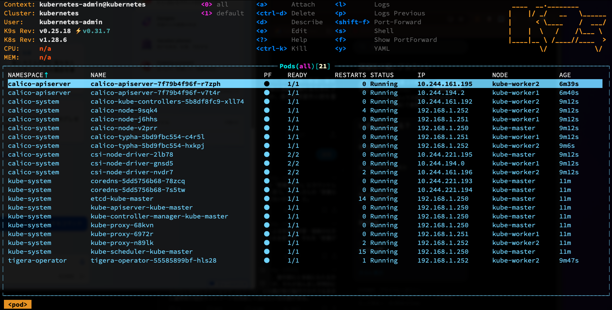

# myhome-k8s
おうちkubernetes

## k9s top

## サーバスペック

### master
- shuttle barebone DS77u
- cpu: Celeron 1.8GHz 2Cores
- memory: 8G
- volume: SSD/240G
- OS: Ubuntu 22.04

 ### worker1
- Intel NUC BOXNUC5CPYH
- cpu: Celeron 2.16GH 2Cores
- memory: 8G
- volumes: SSD/120G
- OS: Ubuntu 22.04

### worker2
- shuttle barebone DS77u
- cpu: Celeron 1.8GHz 2Cores
- memory: 16G
- volume: SSD/240G
- OS: Ubuntu 22.04

## [kubeadm](./kubeadm/README.md)
サーバ
