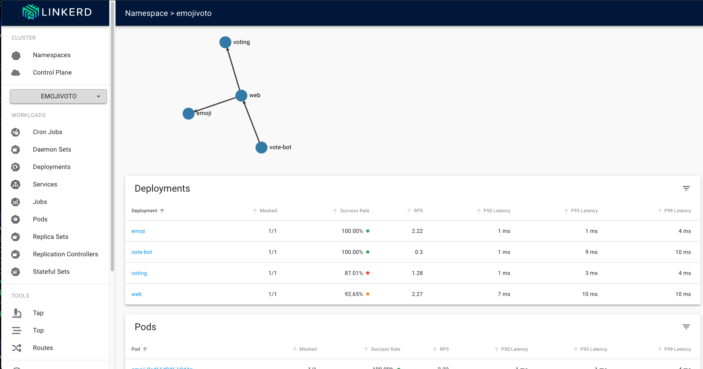

# linkerd 評価メモ

## 準備
```bash
brew install linkerd

linkerd install --crds | kubectl apply -f -

linkerd install --set proxyInit.runAsRoot=true | kubectl apply -f -
```

## linkerdリソース
```bash
❯ k get all 
NAME                                         READY   STATUS    RESTARTS   AGE
pod/linkerd-destination-5d564c7c54-8kg4v     4/4     Running   0          37m
pod/linkerd-identity-655ffd79d-z5wq4         2/2     Running   0          37m
pod/linkerd-proxy-injector-6558bf874-7sl4h   2/2     Running   0          37m

NAME                                TYPE        CLUSTER-IP       EXTERNAL-IP   PORT(S)    AGE
service/linkerd-dst                 ClusterIP   10.244.154.79    <none>        8086/TCP   37m
service/linkerd-dst-headless        ClusterIP   None             <none>        8086/TCP   37m
service/linkerd-identity            ClusterIP   10.244.133.24    <none>        8080/TCP   37m
service/linkerd-identity-headless   ClusterIP   None             <none>        8080/TCP   37m
service/linkerd-policy              ClusterIP   None             <none>        8090/TCP   37m
service/linkerd-policy-validator    ClusterIP   10.244.138.153   <none>        443/TCP    37m
service/linkerd-proxy-injector      ClusterIP   10.244.185.1     <none>        443/TCP    37m
service/linkerd-sp-validator        ClusterIP   10.244.93.88     <none>        443/TCP    37m

NAME                                     READY   UP-TO-DATE   AVAILABLE   AGE
deployment.apps/linkerd-destination      1/1     1            1           37m
deployment.apps/linkerd-identity         1/1     1            1           37m
deployment.apps/linkerd-proxy-injector   1/1     1            1           37m

NAME                                               DESIRED   CURRENT   READY   AGE
replicaset.apps/linkerd-destination-5d564c7c54     1         1         1       37m
replicaset.apps/linkerd-identity-655ffd79d         1         1         1       37m
replicaset.apps/linkerd-proxy-injector-6558bf874   1         1         1       37m

NAME                              SCHEDULE      SUSPEND   ACTIVE   LAST SCHEDULE   AGE
cronjob.batch/linkerd-heartbeat   24 12 * * *   False     0        28m             37m
```

## demo
参考: https://amateur-engineer-blog.com/getting-started-linkerd/

### demo install
```bash
curl --proto '=https' --tlsv1.2 -sSfL https://run.linkerd.io/emojivoto.yml \
  | kubectl apply -f -
```

### injection
```bash
kubectl get -n emojivoto deploy -o yaml \
  | linkerd inject - \
  | kubectl apply -f -
```
[emoji_vote_deployment_original.yaml](./emoji_vote_deployment_original.yaml)
[emoji_vote_deployment_injected.yaml](./emoji_vote_deployment_injected.yaml)
```bash
  - apiVersion: apps/v1
    kind: Deployment
    metadata:
      annotations:
        deployment.kubernetes.io/revision: "1"
    <snip>
    spec:
      template:
        metadata:
          annotations:
            linkerd.io/inject: enabled <-追加される
```

### inject前
```bash
❯ k get all                                    
NAME                          READY   STATUS    RESTARTS   AGE
pod/emoji-649dfd6b7f-86wc8    1/1     Running   0          16m
pod/vote-bot-bbcc988b-df9p7   1/1     Running   0          16m
pod/voting-77c6b77ffd-4fzpd   1/1     Running   0          16m
pod/web-77b75995d-lmxqz       1/1     Running   0          16m

NAME                 TYPE        CLUSTER-IP       EXTERNAL-IP   PORT(S)             AGE
service/emoji-svc    ClusterIP   10.244.118.249   <none>        8080/TCP,8801/TCP   16m
service/voting-svc   ClusterIP   10.244.133.115   <none>        8080/TCP,8801/TCP   16m
service/web-svc      ClusterIP   10.244.84.231    <none>        80/TCP              16m

NAME                       READY   UP-TO-DATE   AVAILABLE   AGE
deployment.apps/emoji      1/1     1            1           16m
deployment.apps/vote-bot   1/1     1            1           16m
deployment.apps/voting     1/1     1            1           16m
deployment.apps/web        1/1     1            1           16m

NAME                                DESIRED   CURRENT   READY   AGE
replicaset.apps/emoji-649dfd6b7f    1         1         1       16m
replicaset.apps/vote-bot-bbcc988b   1         1         1       16m
replicaset.apps/voting-77c6b77ffd   1         1         1       16m
replicaset.apps/web-77b75995d       1         1         1       16m
```

### inject後
```bash
❯ k get all
NAME                            READY   STATUS    RESTARTS   AGE
pod/emoji-8cd66d8d6-k8d4g       2/2     Running   0          87s
pod/vote-bot-8654bf8cf9-nkvzf   2/2     Running   0          87s
pod/voting-7d5c4794f7-vqjjq     2/2     Running   0          87s
pod/web-64b4c47855-xw6rt        2/2     Running   0          87s

NAME                 TYPE        CLUSTER-IP       EXTERNAL-IP   PORT(S)             AGE
service/emoji-svc    ClusterIP   10.244.118.249   <none>        8080/TCP,8801/TCP   19m
service/voting-svc   ClusterIP   10.244.133.115   <none>        8080/TCP,8801/TCP   19m
service/web-svc      ClusterIP   10.244.84.231    <none>        80/TCP              19m

NAME                       READY   UP-TO-DATE   AVAILABLE   AGE
deployment.apps/emoji      1/1     1            1           19m
deployment.apps/vote-bot   1/1     1            1           19m
deployment.apps/voting     1/1     1            1           19m
deployment.apps/web        1/1     1            1           19m

NAME                                  DESIRED   CURRENT   READY   AGE
replicaset.apps/emoji-649dfd6b7f      0         0         0       19m
replicaset.apps/emoji-8cd66d8d6       1         1         1       87s
replicaset.apps/vote-bot-8654bf8cf9   1         1         1       87s
replicaset.apps/vote-bot-bbcc988b     0         0         0       19m
replicaset.apps/voting-77c6b77ffd     0         0         0       19m
replicaset.apps/voting-7d5c4794f7     1         1         1       87s
replicaset.apps/web-64b4c47855        1         1         1       87s
replicaset.apps/web-77b75995d         0         0         0       19m
```

### vizのinstall/dashboard起動
```bash
linkerd viz install | kubectl apply -f -

linkerd viz dashboard &
```


### HTTPRouteの評価
参考: https://zenn.dev/mikutas/articles/1e222e665e9d73
